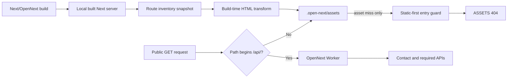

# kuro-lab.com Static-First Cloudflare Design

**Status:** Approved design; documentation only

**Date:** 2026-08-04

**Production authority:** This document does not authorize implementation, upload, deployment, Route changes, or any other Cloudflare mutation.

## 1. Context and diagnosis

Production intermittently returned Cloudflare 500/503 errors corresponding to Error 1101/1102. The same production deployment also failed through its `workers.dev` endpoint, so DNS and the custom-domain Route are not the primary cause.

Sanitized 24-hour evidence showed 1,448 successful invocations and 50 `exceededResources` outcomes, while `scriptThrewException` and `internalError` were both zero. Resource-error CPU time had a 10 ms median and an approximately 855 ms p99. Failures moved between routes and included the legal route, which does not use the current static-document self-fetch path.

The supported diagnosis is therefore Worker CPU/resource exhaustion. `WORKER_SELF_REFERENCE` recursion and request-time HTML rewriting can amplify cost, but the evidence does not support calling self-binding the sole cause. This is not presently explained as ordinary short-term traffic volume or user refreshes.

The investigation was read-only. It sent GET requests only, did not submit Contact data, did not call live Turnstile or Resend, and did not mutate the repository or Cloudflare configuration.

## 2. Decision

All public GET documents and control assets will be served from Cloudflare Static Assets. Matching assets bypass Worker code. `/api/*`, including `/api/contact`, enters OpenNext; a non-API asset miss may enter only a lightweight entry guard and must never fall through to OpenNext SSR.

The public surface includes:

- Japanese and English primary pages
- Japanese and English Guide pages
- legal pages
- redirects and the custom 404 page
- `robots.txt`, `sitemap.xml`, Open Graph images, favicon, and other public assets

The chosen approach is a build-time HTML snapshot layered after the existing Next/OpenNext build. This preserves the current application source and metadata behavior while moving document delivery out of the Worker runtime. It is preferred over a broad Next static-export refactor and over splitting production ownership between Pages and Workers.

## 3. Target architecture

The Cloudflare asset binding remains `.open-next/assets`, but asset routing becomes explicit:

- `run_worker_first: ["/api/*"]`
- `html_handling: "drop-trailing-slash"`
- `not_found_handling: "404-page"`

Cloudflare invokes a Worker script when no matching asset is found even when assets are checked first. Therefore, add a stable wrapper entry point that delegates `/api/*` to the generated OpenNext handler and sends every other miss back to `env.ASSETS.fetch(request)`. The guard must not import or execute a public-page SSR path for non-API requests. Contract tests include an unknown path and a missing asset request without `Sec-Fetch-Mode` to prove neither reaches OpenNext SSR.

`CONTACT_RATE_LIMITER`, observability, `keep_vars`, `workers_dev`, and preview URLs remain configured.

## 4. Build-time document pipeline

### Route authority

Create `lib/public-route-inventory.mjs` as the single authority for public routes. The snapshot builder and `app/sitemap.js` must derive their route sets from it, including current publication and Guide visibility rules. A contract test must detect drift between generated assets and the sitemap.

### Snapshot orchestration

Create `scripts/build-static-first-cloudflare.mjs` to:

1. preserve the complete previous `.open-next` output in a sibling recovery directory and fail if an unresolved recovery marker already exists;
2. run the existing OpenNext build into a clean output directory;
3. start the built Next application locally on an isolated port;
4. GET every public route from the inventory without contacting production, setting `x-kurodev-locale` from the pathname for the build-only request;
5. initialize the candidate from the complete OpenNext asset output so images, fonts, favicon, and generated media are retained;
6. transform each successful response into a static document;
7. write `_headers`, `_redirects`, and `404.html` into the candidate;
8. validate the complete candidate; and
9. keep the new full `.open-next` output only after every check passes, otherwise restore the previous full output.

The temporary server must always be terminated. Recovery handles ordinary failures and interruption on the next invocation; it must never silently combine old and new output. Generated `.next` and `.open-next` output remains ignored and is not committed.

### HTML transformation

Refactor `lib/static-guide-document.mjs` into a pure build-time transformer. Remove the runtime `fetchStaticSourceResponse` path and all dependency on a self-service binding.

The transformer removes Next hydration scripts, Flight payloads, and script preloads, then installs only the small behavior islands required by the rendered page:

- theme selection
- mobile navigation
- skip-link behavior
- Guide interaction
- Contact form, consent, Turnstile, and submission behavior

All meaningful page copy, navigation, metadata, legal text, and Guide content must remain usable with JavaScript disabled.

### Output contract

Expected output includes `index.html`, locale and nested-route HTML documents, Guide documents, `legal/tokushoho.html`, `404.html`, `robots.txt`, `sitemap.xml`, Open Graph assets, favicon assets, `_headers`, and `_redirects`.

Generation fails closed if any of the following occurs:

- a route is non-200 or has an unexpected content type;
- Next hydration scripts, Flight payloads, or prohibited preloads remain;
- `lang`, title, description, canonical URL, `h1`, or `main` is missing where required;
- required behavior islands are absent;
- the approved `NEXT_PUBLIC_TURNSTILE_SITE_KEY` is absent or malformed when producing the Contact island;
- headers, redirects, 404, robots, sitemap, or route inventory disagree;
- any local `src`, `srcset`, or `href` target is missing from the candidate assets;
- an extensionless generated asset such as `/opengraph-image` has an incorrect response content type;
- the local server cannot start or stop cleanly; or
- only a partial candidate asset set was produced.

No Contact POST or live provider request is permitted during the build.

## 5. Runtime removal and API boundary

Delete `WORKER_SELF_REFERENCE` from `wrangler.jsonc`. Remove the self-fetch middleware and request-time document transforms; delete `middleware.js` after the snapshot builder supplies the route-derived locale header directly. Set Wrangler `main` to the stable static-first wrapper, which delegates only `/api/*` to the generated OpenNext handler. Locale and route-specific output are resolved when the snapshot is built.

The Contact API keeps its current fail-closed sequence:

1. rate limit;
2. JSON parsing;
3. validation;
4. consent verification;
5. Turnstile verification;
6. Resend delivery.

No secret, provider credential, rate-limit binding, or Contact semantics move into browser code.

## 6. Verification contract

Implementation begins with focused failing contract tests, followed by the minimum code needed to pass them. Required automated checks are:

- focused static-first contract tests;
- complete `npm test`;
- `npm run lint`;
- `npm run build`;
- the new static-first Cloudflare build;
- generated asset inventory validation;
- link/media integrity and MIME validation, including extensionless Open Graph output;
- `wrangler deploy --dry-run --keep-vars --strict`;
- `git diff --check` and an intended-files review.

No package or lockfile change is expected.

Browser QA runs against local `wrangler dev`, not `next start`, so Cloudflare asset routing, `_headers`, `_redirects`, 404 behavior, and the entry guard are exercised. It covers widths 375 and 1280 for the five primary routes, seven legal routes, Japanese and English Guide boundaries, redirects, 404, robots, sitemap, Open Graph assets, favicon, theme, menu, skip link, and Contact UI. It requires zero unexpected console/network errors and no horizontal overflow. A JavaScript-disabled pass confirms that public content remains readable.

The existing formal performance gate remains: Lighthouse 13.4.1, five routes, mobile and desktop, three runs each, with every median at 100.

## 7. Release gates

Each phase requires separate owner approval:

1. repository implementation;
2. local verification;
3. commit;
4. push and Draft PR;
5. merge;
6. Worker version upload;
7. version-specific preview URL GET-only QA;
8. production deployment;
9. custom-domain post-deploy checks; and
10. cleanup.

An upload must not receive production traffic. Production deployment is considered only after the uploaded version passes preview QA.

After an approved deployment, monitor immediately and at 15 minutes, 1 hour, and 2 hours. Check the five primary routes, seven legal routes, the custom domain and `workers.dev`, and confirm the new version has zero `exceededResources` events. Contact POST remains prohibited without separate approval.

## 8. Rollback

Do not remove the full custom-domain Route. If a rollback trigger fires, restore the previous known-good Worker version; do not fall back to the stale Pages deployment.

Before deployment, record a sanitized rollback packet containing the previous and candidate versions, Route state, binding/variable/secret presence, actor, and rollback commands. Never include secret values or raw account, token, deployment, or build identifiers in reports.

Rollback triggers include route 5xx, unexpected 404, broken rendering, missing security headers, redirect or robots/sitemap regressions, Contact binding failures, unexpected Worker invocation for public GETs, or resource-limit errors.

## 9. Expected result and residual risk

The design removes normal page delivery from the CPU-limited Worker path and eliminates self-binding recursion, so it is the best zero-additional-service-cost mitigation supported by the current evidence. It does not prove that Cloudflare will never return a platform-level failure, and it requires full build and preview validation before production activation.
